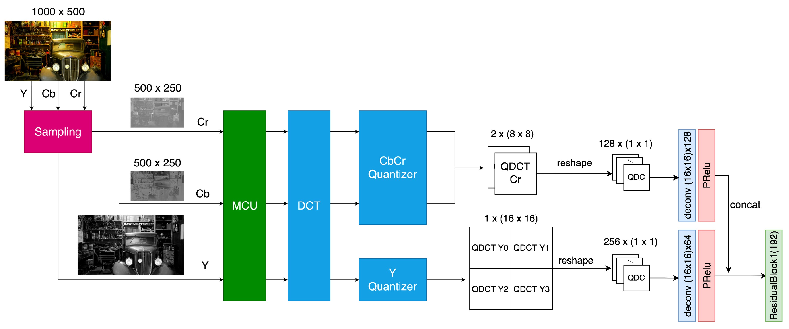
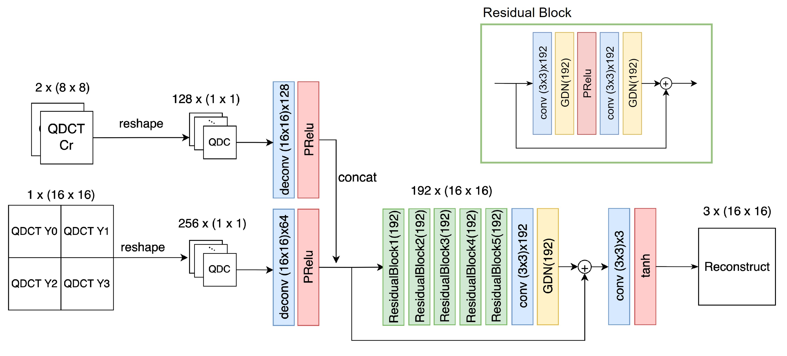
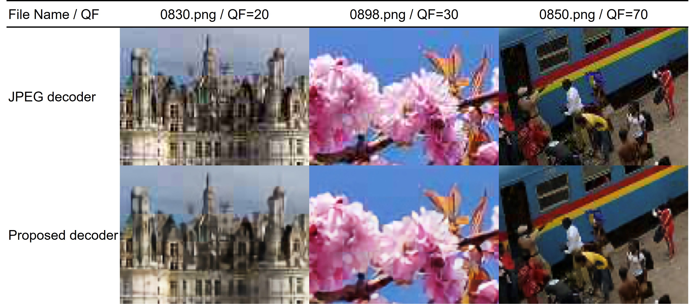
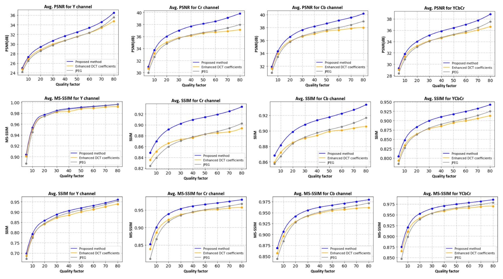

# learned JPEG Decoder

Implementation of paper - [Deep Learning Approach to the Quality Restoration for JPEG Images](https://dl.acm.org/doi/abs/10.1145/3556223.3556238)

```
python train.py -e [EPOCHS] -m [MODEL_TYPE] -d [DATASET] -q [QFactor] -b [BATCH_SIZE] -vb [VAL_BATCH_SIZE] -o [OUTPUT_MODEL_NAME] -s [save model0] -n [INPUT DIMS] -w [WORKS]
```

## System architecture

<div align="center">
    <a href="./">
        
    </a>
</div>

<div align="center">
    <a href="./">
        
    </a>
</div>


## Experimental results

<div align="center">
    <a href="./">
        
    </a>
</div>

<div align="center">
    <a href="./">
        
    </a>
</div>